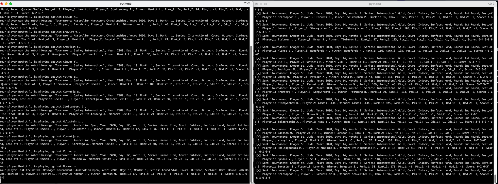

# streaming-07-final-project

## Author: Jose Guzman 

## Original Data Source
The Data for this project was obtained on [Kaggle](https://www.kaggle.com/datasets/dissfya/atp-tennis-2000-2023daily-pull)

## What the project does? 
The project demonstartes the use of streaming data from a CSV file using producers and consumers.  The producer file send the data from the atp_tennis.csv file and place it in a RabbitMQ queue.  The consumer will then ask the user to input a players Last name and first name initial.  The code will then listen for the following: 
- If the player is in the player_1 or player_2 column it will sned an alert stating the player is playing against the opoonent llisted in the data set. 
- If the player is in the Winner column an alert will be sent that the player has won the match. The match details will be sent.
- If the player is not in the Winner oclumn an alert will be sent that the player has lost the match.  The match details will be sent. 

## Demo of the Project 
